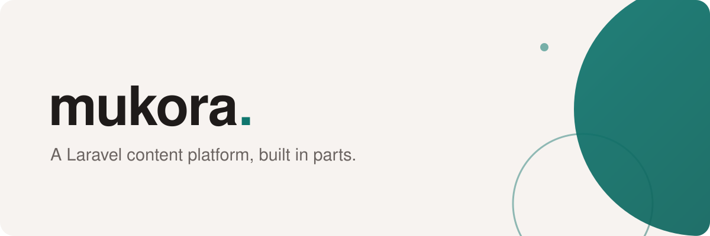

  <a href="https://simtabi.com">
    <picture>
      <source media="(prefers-color-scheme: dark)" srcset="banner-dark.svg">
      
    </picture>
  </a>

# A Laravel content platform, built in parts.

Mukora CMS is a content platform assembled from small Laravel packages rather
than shipped as one monolith. An API layer, asset management, a form builder, a
data synchroniser and developer tooling sit at the core; everything optional —
media handling, scheduling, translations, log viewing, maintenance mode,
impersonation, importers — arrives as a plugin that can be left out.

That split is the point. A CMS becomes hard to live with when the feature you do
not want is welded to the one you do, and when upgrading the platform means
upgrading every decision it made for you. Versioning the parts separately means a
site takes what it needs, and a plugin can move at its own pace without holding
the core still.

Development happens in private while the interfaces settle. Nothing here is
public yet, and this page will list repositories when there are repositories
worth listing — not before.

## Get in touch

- Working with us on a Mukora build? Your usual contact is the fastest route.
- Anything else: [opensource@simtabi.com](mailto:opensource@simtabi.com). A human
  reads it.

Built and maintained by the team at [Simtabi](https://simtabi.com).
